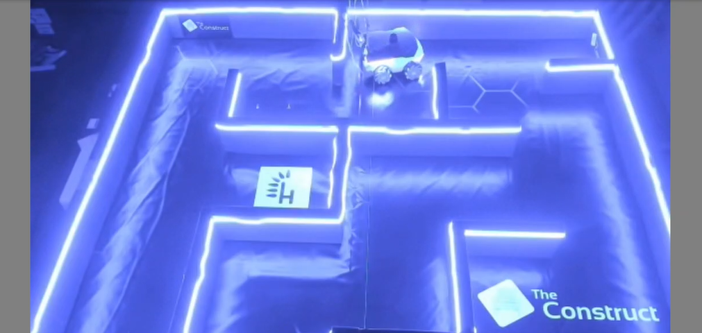

# CheckPoint 10 Robot Control

<a name="readme-top"></a>

## About The Project
In this project the CyberLab Rosbot XL, a real hardware holonomic or omni-directional robot is used. The primary objective is to program the Rosbot XL to navigate through the CyberLab maze successfully. To achieve this, waypoints to guide the robot towards the goal position were provided. Additionally, control algorithms (PID) were tuned to facilitate fast and precise movements, enabling the robot to traverse each waypoint with optimal speed and accuracy. 



<!-- GETTING STARTED -->
## Getting Started

### Software Prerequisites
* Ubuntu 22.04
* ROS2 Humble


<p align="right">(<a href="#readme-top">back to top</a>)</p>

<!-- INSTALLATION -->
### Installation
1. Clone the repo:
   ```sh
   cd ~ && \
   git clone https://github.com/pvela2017/The-Construct-CheckPoint-7-Manipulation-Perception
   ```
2. Compile the simulation:
   ```sh
   source /opt/ros/humble/setup.bash && \
   cd ~/The-Construct-CheckPoint-7-Manipulation-Perception/ros2_ws && \
   colcon build
   ```
     
<p align="right">(<a href="#readme-top">back to top</a>)</p>


<!-- USAGE -->
## Usage
### Local Simulation & Real Robot
1. Launch the simulation:
   ```sh
   source /opt/ros/humble/setup.bash && \
   source ~/The-Construct-CheckPoint-7-Manipulation-Perception/ros2_ws/install/setup.bash && \
   ros2 launch the_construct_office_gazebo warehouse_ur3e.launch.xml
   ```
2. Launch move group:
   ```sh
   source /opt/ros/humble/setup.bash && \
   source ~/The-Construct-CheckPoint-7-Manipulation-Perception/ros2_ws/install/setup.bash && \
   ros2 launch my_moveit_config move_group.launch.py    # simulation
   ros2 launch real_moveit_config move_group.launch.py  # real
   ```
3. Launch moveit rviz interface:
   ```sh
   source /opt/ros/humble/setup.bash && \
   source ~/The-Construct-CheckPoint-7-Manipulation-Perception/ros2_ws/install/setup.bash && \
   ros2 launch my_moveit_config moveit_rviz.launch.py    # simulation
   ros2 launch real_moveit_config moveit_rviz.launch.py  # real
   ```
4. Pick and Place without perception:
   ```sh
   source /opt/ros/humble/setup.bash && \
   source ~/The-Construct-CheckPoint-7-Manipulation-Perception/ros2_ws/install/setup.bash && \
   ros2 launch moveit2_scripts pick_and_place_sim.launch.py    # simulation
   ros2 launch moveit2_scripts pick_and_place.launch.py        # real
   ```
6. Launch perception:
   ```sh
   source /opt/ros/humble/setup.bash && \
   source ~/The-Construct-CheckPoint-7-Manipulation-Perception/ros2_ws/install/setup.bash && \
   ros2 launch get_cube_pose get_pose_client.launch.py    # simulation
   ```   
7. Pick and Place with perception:
   ```sh
   source /opt/ros/humble/setup.bash && \
   source ~/The-Construct-CheckPoint-7-Manipulation-Perception/ros2_ws/install/setup.bash && \
   ros2 launch moveit2_scripts pick_and_place_perception_sim.launch.py    # simulation
   ros2 launch moveit2_scripts pick_and_place_perception.launch.py        # real
   ```

<p align="right">(<a href="#readme-top">back to top</a>)</p>

<!-- RESULTS -->
## Results
[](https://www.youtube.com/watch?v=s4jkbh0bWyQ)

<!-- KEYS -->
## Key topics learnt
* Moveit2.
* Perception.
